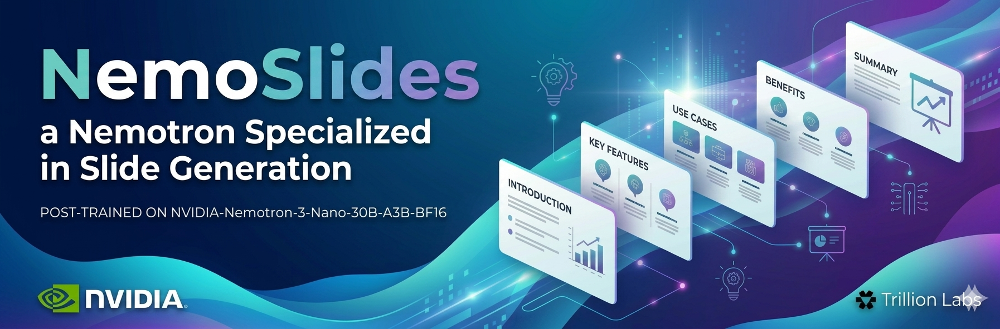
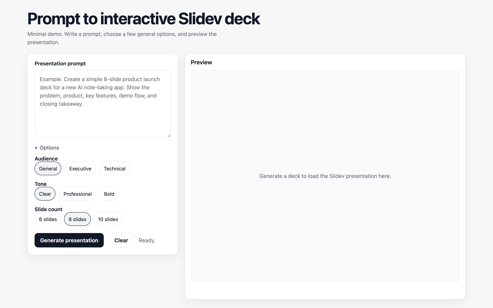

<p align="center">
  
</p>

<h3 align="center">Open-weight slide generation, fine-tuned on Nemotron.</h3>

<p align="center">
  <a href="https://opensource.org/licenses/Apache-2.0"></a>
  <a href="https://build.nvidia.com"></a>
  <a href="https://huggingface.co/collections/trillionlabs/nemoslides"></a>
  <a href="https://huggingface.co/trillionlabs/NemoSlides"></a>
  <a href="https://huggingface.co/datasets/trillionlabs/NemoSlides-SFT-mix-v1.0"></a>
</p>

<p align="center">
  <a href="https://trillion-labs.github.io/nemoslides/">Docs</a> ·
  <a href="#quickstart">Quickstart</a> ·
  <a href="#results">Results</a>
</p>

Fine-tune of `NVIDIA-Nemotron-3-Nano-30B-A3B` (3B active, MoE) on 705 Slidev decks. Prompt in, deck out — runs locally.

## Why this exists

Paid slide-AI (Gamma, Beautiful.ai, Copilot) locks outputs to template brands you can't escape. Open-source LLMs produce broken Slidev syntax, text-only walls, no visual craft — you end up hand-editing anyway.

NemoSlides is a 30B open-weight model trained to generate full Slidev decks — layouts, shiki-highlighted code, Mermaid, KaTeX, `v-click`, speaker notes — that render on the first try. Local. Open weights. No lock-in.

## Results

<p align="center">
  
</p>

`nemoslides-30b-a3b` ranks **#1 on SlidevBench** — 3.69 floor / 3.99 renderable. Beats `gpt-5.4`, `glm-5.1`, and `nemotron-super` (120B). **+48% over the Nano base.**

<p align="center">
  
</p>

Numbers → [`comparison_table.md`](results/eval/comparison_table.md). Rubric + methodology → [docs](docs/04-evaluation.md).

## Live demo

<p align="center">
  <a href="https://nemoslides-production.up.railway.app">
    
  </a>
</p>

<p align="center">
  Try it → <a href="https://nemoslides-production.up.railway.app"><b>nemoslides-production.up.railway.app</b></a>
</p>

Paste a prompt, get a rendered Slidev deck. Served from the vLLM endpoint behind the app.

## Before / after

Same prompt, base Nemotron Nano vs. the SFT. No curation — first render, both sides.

<table>
  <tr>
    <td align="center"><b>Base</b><br/><sub><code>nemotron-nano</code></sub></td>
    <td align="center"><b>SFT</b><br/><sub><code>NemoSlides</code></sub></td>
  </tr>
  <tr>
    <td></td>
    <td></td>
  </tr>
  <tr>
    <td></td>
    <td></td>
  </tr>
  <tr>
    <td></td>
    <td></td>
  </tr>
</table>

More samples → [live 30-prompt × 5-model gallery](https://trillion-labs.github.io/nemoslides/gallery/).

## Quickstart

```bash
uv sync                       # installs nemoslides + deps
cp .env.example .env          # fill: OPENROUTER_API_KEY, UNSPLASH_ACCESS_KEY
cd assets/renderer && npm i && cd ../..
uv run uvicorn nemoslides.demo.app:app --reload    # prompt-to-deck web UI
```

Pipeline: synthesize 705 Slidev decks with NeMo Data Designer + Codex, render-validate each, SFT with NeMo-RL (LoRA + FSDP2). Full writeup → [docs](docs/index.md); end-to-end reproduction → [`reproduce.md`](docs/reproduce.md).

## Star History

<p align="center">
  <a href="https://star-history.com/#trillion-labs/nemoslides&Date">
    
  </a>
</p>

<p align="center">Built for the <b>NVIDIA Nemotron Hackathon 2026 · Track B</b> by <a href="https://trillionlabs.co">Trillion Labs</a>. Apache-2.0 code · <a href="https://www.nvidia.com/en-us/agreements/enterprise-software/nvidia-nemotron-open-model-license/">NVIDIA Open Model License</a> weights · dataset research-use. <a href="https://github.com/trillion-labs/nemoslides">Star the repo</a> if you find it useful.</p>
