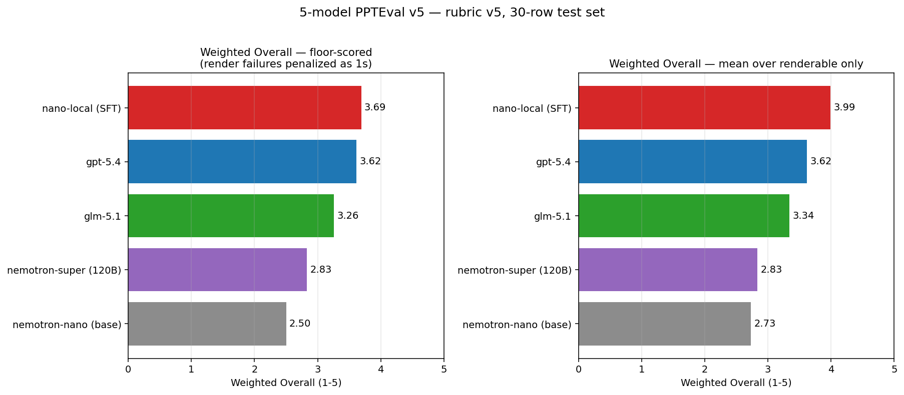
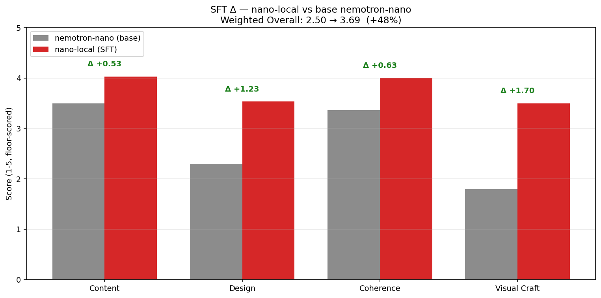

<p align="center">
  
</p>

<h3 align="center">Open-weight slide generation, fine-tuned on Nemotron.</h3>

<p align="center">
  <a href="https://github.com/trillion-labs/nemoslides/stargazers"></a>
  <a href="https://github.com/trillion-labs/nemoslides/network/members"></a>
  <a href="https://github.com/trillion-labs/nemoslides/issues"></a>
  <a href="https://opensource.org/licenses/Apache-2.0"></a>
  <a href="https://build.nvidia.com"></a>
  <a href="https://huggingface.co/datasets/trillionlabs/slides-sft-v0"></a>
</p>

<p align="center">
  <a href="https://trillion-labs.github.io/nemoslides/">Docs</a> ·
  <a href="#quickstart">Quickstart</a> ·
  <a href="#results">Results</a>
</p>

---

Fine-tune of `NVIDIA-Nemotron-3-Nano-30B-A3B` (3B active, MoE) on 705 Slidev decks. Prompt in, deck out — runs locally.

## Results

<p align="center">
  
</p>

`nemoslides-30b-a3b` ranks **#1 on SlidevBench** — 3.69 floor / 3.99 renderable. Beats `gpt-5.4`, `glm-5.1`, and `nemotron-super` (120B). **+48% over the Nano base.**

<p align="center">
  
</p>

Numbers → [`comparison_table.md`](results/eval/comparison_table.md). Rubric + methodology → [docs](docs/04-evaluation.md).

## Quickstart

```bash
uv sync                       # installs nemoslides + deps
cp .env.example .env          # fill: OPENROUTER_API_KEY, UNSPLASH_ACCESS_KEY
cd assets/renderer && npm i && cd ../..
uv run uvicorn nemoslides.demo.app:app --reload    # prompt-to-deck web UI
```

## How it works

Synthesize 705 Slidev decks with NeMo Data Designer + Codex, render-validate each, SFT with NeMo-RL (LoRA + FSDP2). Full pipeline in [docs](docs/index.md).

## Repo

```
nemoslides/
├── src/nemoslides/        pipeline · cli · eval · demo · blindtest · train
├── assets/                renderer/ (pinned Slidev) · reference/ (Slidev docs + gold examples)
├── data/                  seeds · theme profiles · image bank
├── results/               eval JSONs · qualitative renders · blindtest DB
├── docs/                  reviewer writeup (mkdocs)
└── tests/
```

## Reproduce

See [docs/reproduce.md](docs/reproduce.md).

## License

Code: Apache-2.0. Model weights: governed by the [NVIDIA Open Model License](https://developer.download.nvidia.com/licenses/nvidia-open-model-license-agreement). Dataset: research use only.

---

<p align="center">Built for the <b>NVIDIA Nemotron Hackathon 2026 · Track B</b> by <a href="https://trillionlabs.co">Trillion Labs</a>. If you find this useful, <a href="https://github.com/trillion-labs/nemoslides">star the repo</a>.</p>
