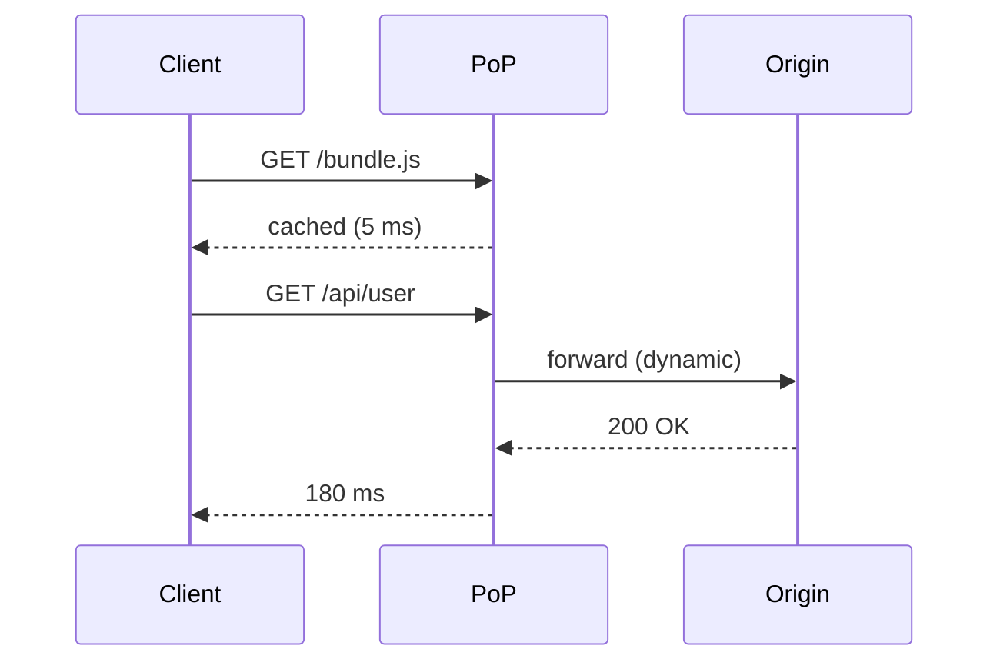

# How CDNs Make the Web Fast

### A 10-minute tour for backend engineers

<div class="pt-6 opacity-70 text-sm">
  QCon London · 2025
</div>

---
layout: statement
---

# The web is slow by default.

### Light takes 40 ms to cross the Atlantic.

---
layout: two-cols
---

# The problem

- Every request goes to your origin
- Users in Tokyo wait for your US server
- Your DB becomes the bottleneck
- You pay egress on every byte

::right::

# The shape of the fix

- Cache static assets close to users
- Terminate TLS at the edge
- Absorb origin load
- Pay once, serve many times

---
layout: image-right
image-query: "world map with glowing network nodes connected by lines"
---

# How a CDN works

- Thousands of **PoPs** near users
- DNS routes clients to the nearest one
- PoP serves cached assets locally
- On miss, fetch from origin and cache

<!-- Anycast + geo-DNS do the routing magic. -->

---
layout: default
---

# Cache key, TTL, and the hard parts

```ts {1|3-5|7|all}
const key = `${host}${path}?${sortedQuery}`

// cached response is fresh while
// now < storedAt + maxAge
// and no revalidation is required

return cache.get(key) ?? fetchOriginAndStore(key)
```

Cache invalidation is the hardest problem — version URLs, never filenames.

---
layout: default
---



---
layout: fact
---

# 40×

### Median latency drop when a request hits a nearby PoP

---
layout: center
---

<v-clicks>

- Cache static at the edge
- Keep dynamic at origin — for now
- Measure **p95**, not average
- Version your assets, never your hostnames

</v-clicks>

---
layout: end
---

# Ship fast. Cache harder.

### questions?
