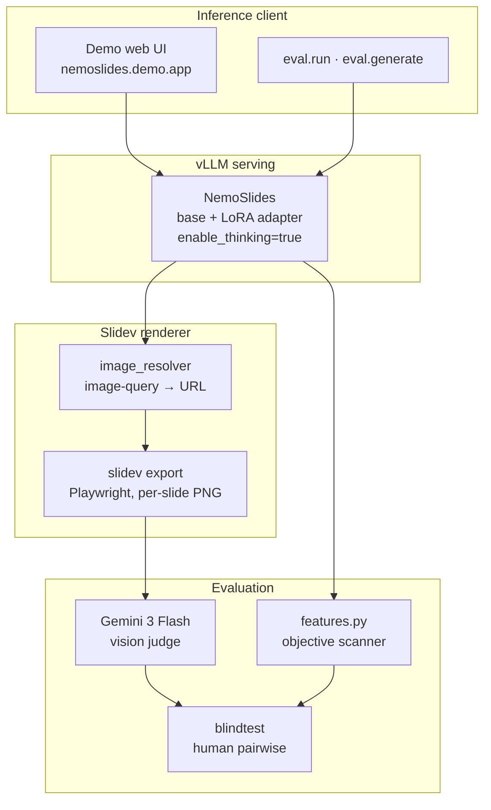

# 01 — Architecture

*NemoSlides is a LoRA adapter on top of `NVIDIA-Nemotron-3-Nano-30B-A3B-BF16`, served via vLLM with the same inference path as the base model. The training stack is NeMo-RL; the data stack is NVIDIA Data Designer plus Codex-driven per-seed authoring; the evaluation stack is Gemini 3 Flash as a vision judge plus an objective markdown feature scanner.*

## Repository layout

```
nemoslides/
├── src/nemoslides/
│   ├── cli/              data pipeline commands (codex_pipeline, push_hf_dataset)
│   ├── demo/             FastAPI prompt-to-deck web UI (nemoslides.demo.app:app)
│   ├── blindtest/        human pairwise A/B blindtest (build_pairs, voting app)
│   ├── eval/             generate · render · judge · features · compare · plot
│   ├── pipeline/         Slidev reference pack, OpenAI-compat clients, image tools
│   └── train/            NeMo-RL launch script + LoRA+FSDP2 recipes
├── assets/
│   ├── renderer/         pinned Slidev env; render.sh with parallel-safe export
│   └── reference/        vendored Slidev docs + gold-example decks
├── data/                 seeds · theme profiles · image bank (raw JSONL gitignored)
├── results/              eval JSONs · qualitative renders · blindtest DB
├── docs/                 this site (mkdocs)
└── tests/                pytest suite
```

The project is packaged with hatchling (`packages = ["src/nemoslides"]`) and installed editable via `uv sync`. All modules are invoked as `uv run python -m nemoslides.<subpackage>.<module>`.

## Runtime components



## Module reference

| Module | Role |
|---|---|
| `nemoslides.cli.codex_pipeline` | Materializes per-seed Codex workspaces; validates PROMPT / think / deck outputs; packs into structured records. |
| `nemoslides.cli.push_hf_dataset` | Projects validated records to chat-JSONL with `reasoning_content` and publishes to Hugging Face Hub. |
| `nemoslides.pipeline.slidev_reference` | Compiles a ~45KB / ~11K-token Slidev knowledge pack from the vendored docs; injected at synthesis *and* training-time system prompt so training and inference stay in distributional lockstep. |
| `nemoslides.pipeline.image_resolver` | Rewrites `image-query: "<text>"` placeholders into resolved Unsplash URLs at render time. Bank fallback at `data/image_bank.json` for offline runs. |
| `nemoslides.pipeline.clients` | OpenAI-compatible client factories for OpenRouter (base + reference models), OpenAI (legacy), and the internal vLLM endpoint serving the SFT checkpoint. |
| `nemoslides.eval.generate` | Produces a deck per held-out prompt across any supported reference model. |
| `nemoslides.eval.judge` | Scores rendered PNG slides against the rubric via Gemini 3 Flash, with JSON validation and retry. |
| `nemoslides.eval.features` | Scans raw deck markdown for Slidev primitives (layouts, shiki, Mermaid, KaTeX, v-click, notes, transitions, theme) and maps feature coverage to a 1–5 Visual Craft score. |
| `nemoslides.eval.run` | End-to-end orchestrator: generate → render → judge → score. Resumable per-seed via `score.json` gates. |
| `nemoslides.eval.compare` / `plot` | Aggregates per-seed JSON into comparison tables and matplotlib plots. |
| `nemoslides.train.launch` | Shell entry point that invokes NeMo-RL `run_sft.py` with the LoRA+FSDP2 recipe. |
| `nemoslides.blindtest.build_pairs` | Constructs balanced A/B pair queues from per-seed renders. |
| `nemoslides.blindtest.app` | Flask voting UI backed by a SQLite votes database at `results/blindtest/votes.db`. |
| `nemoslides.demo.app` | FastAPI web server that accepts a prompt, streams a deck from the vLLM endpoint, renders via `assets/renderer/render.sh`, and returns the deck. |

## End-to-end flow

A single prompt moves through NemoSlides as follows.

1. **Input** — user prompt, optionally with topic / audience / tone hints. The demo UI accepts plain text; `eval.generate` loads test prompts from `trillionlabs/slides-sft-v0`.
2. **Generation** — the vLLM endpoint serves the post-trained Nemotron with the LoRA adapter loaded. The model emits `<think>` reasoning followed by Slidev markdown. `enable_thinking=true`; sampling per the Nano-3 model card (`temperature=1.0`, `top_p=1.0`).
3. **Image resolution** — `image_resolver` rewrites every `image-query:` placeholder in the deck to a live Unsplash URL (or a bank fallback when the API key is unset).
4. **Render** — `assets/renderer/render.sh` copies the deck into the pinned Slidev env, exports per-slide PNGs via Playwright, and runs a validator that detects Vue compile errors and single-slide fence-wrap failures.
5. **Score** — in eval mode, the rendered PNGs go to Gemini 3 Flash for three subjective dimensions; the raw markdown goes to `features.py` for the objective Visual Craft dimension; the four scores are aggregated into the weighted Overall.

Detail on data, training, and evaluation rationale lives in the respective sections: [02 · Data](02-data.md), [03 · Training](03-training.md), [04 · Evaluation](04-evaluation.md).
