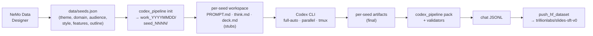

# 02 — Data

*NemoSlides trains on 705 chat-JSONL rows with `<think>` reasoning traces plus Slidev markdown in the assistant turn, published as [`trillionlabs/slides-sft-v0`](https://huggingface.co/datasets/trillionlabs/slides-sft-v0). Seeds are generated with NeMo Data Designer; per-seed authoring is done by Codex CLI with a substance-gated validator pipeline.*

## Dataset spec

| Property | Value |
|---|---|
| Published at | [`trillionlabs/slides-sft-v0`](https://huggingface.co/datasets/trillionlabs/slides-sft-v0) |
| Splits | 705 train · 30 test |
| Format | Chat JSONL (messages array with system / user / assistant) |
| Reasoning | Assistant content contains `<think>{trace}</think>\n\n{deck}`; `reasoning_content` also exposed as a separate field on the assistant turn |
| System prompt | `nemoslides.pipeline.slidev_reference.TASK_INSTRUCTIONS` + Slidev cheatsheet (identical at synthesis, training, and inference) |
| Image references | `image-query: "<natural language>"` placeholders; URLs resolved at render time |
| Themes | `default`, `seriph`, `apple-basic` |
| License | Research use only |

Each row:

```jsonl
{"messages": [
  {"role": "system", "content": "<Slidev expert system prompt + knowledge pack>"},
  {"role": "user", "content": "Create a Slidev deck: <topic · audience · tone · constraints>"},
  {"role": "assistant", "content": "<think>\n<reasoning>\n</think>\n\n---\ntheme: seriph\nlayout: cover\n---\n# ..."}
]}
```

## Synthesis pipeline



### Seed generation — NeMo Data Designer

Seeds are `(theme, domain, audience, style, features, outline?)` tuples sampled from a categorical spine. Implementation in `nemoslides.pipeline.seeds_dd`:

- **Categorical spine** — theme ∈ {default, seriph, apple-basic}, domain spans pitch decks / tech talks / product launches / internal reviews / conferences / educational content, audience and tone enumerate ~10 variants each, feature set covers the Slidev capability surface (layouts, shiki, Mermaid, KaTeX, v-click, transitions, presenter notes).
- **LLM spine** — each seed's free-text fields (title, abstract, narrative beats) are generated by `z-ai/glm-5.1` via OpenRouter.
- **Output** — seeds are persisted to `data/seeds.json` (canonical set) and `data/seeds.d/batch_NNNN.json` (per-batch archives).

### Per-seed authoring — Codex CLI

`nemoslides.cli.codex_pipeline init` materializes one folder per seed under `work_YYYYMMDD/seed_NNNN/`, each containing:

- `seed.json` — the structured seed record
- `INSTRUCTIONS.md` — compiled contract: workflow, quality rubric, Slidev cheatsheet (see `codex_templates/`)
- `HERO_EXAMPLE.md` — a gold-example deck from `assets/reference/gold_examples/`
- Stub `PROMPT.md`, `think.md`, `deck.md` with `Codex:` marker headers

`scripts/run_codex_batch.sh` invokes Codex CLI in parallel (tmux-driven, 6-way default concurrency). Per seed, Codex:

1. **Writes the user-side prompt (`PROMPT.md`)** — a realistic request with topic, audience, and any style constraints. This is the string that will be passed to the finetuned model at inference.
2. **Writes the reasoning trace (`think.md`)** — structured prose under fixed headings (`Reading the user prompt`, `Theme fit`, `Narrative arc`, `Key slide mapping`, `Image & feature choices`, `Self-review`). 350–900 words. The self-review section is contractually mandatory before `deck.md` is written.
3. **Writes the final deck (`deck.md`)** — renderable Slidev markdown that executes the plan in `think.md`.

The reasoning trace is not a demo prop. It is the primary training signal: the finetuned model inherits a habit of reading the prompt, planning theme and narrative, mapping content to layouts, and self-reviewing before producing slides. Per-seed Codex authoring (vs. single-shot LLM synthesis) is chosen specifically because one-shot generation over-compresses both artifacts — the reasoning goes sketchy, the deck drops its tail slides — whereas per-seed authoring gives file access, iteration, and a mandatory self-review gate at the cost of synthesis wall-clock.

### Validation — substance + syntactic gates

`nemoslides.cli.codex_pipeline pack` scans each seed folder and drops non-conformant rows before publishing. Gates:

| Gate | Condition |
|---|---|
| Stub detection | Files beginning with `<!--\nCodex:` markers are treated as unwritten. |
| Minimum bytes | PROMPT ≥ 40 bytes, think ≥ 400, deck ≥ 300 (enforced pre-packing). |
| Theme whitelist | `theme:` must be one of `default`, `seriph`, `apple-basic`. |
| Layout whitelist | Every `layout:` must be in the Slidev built-in set. |
| Frontmatter hygiene | No blank lines between `---` and `layout:`; no double frontmatter; no trailing `---` past the final slide. |
| Prompt sanitation | Rejects PROMPTs containing internal-pipeline terminology (`think.md`, `chain-of-thought`, `SFT`, `training data`). |
| Image-URL ban | `image:` lines with raw `https://` URLs are rejected — all image references must use the `image-query:` placeholder. |
| Mermaid component guard | Rejects decks using a stale `<Mermaid chart={\`...\`}>` Vue-component form that Slidev no longer supports cleanly. |

Folders failing any gate are preserved in the workspace but excluded from packing. At last pack, 651 of the Codex-authored folders passed all gates. The final published dataset ships 705 train + 30 test after deduplication and a quality pass.

## Slidev feature coverage

The dataset spans the full Slidev capability surface rather than a whitelisted subset. A narrower surface would give tighter loss curves, but the visible capability gap from the base model lives in the advanced features (shiki line-highlighting, Mermaid, KaTeX, `v-click`, non-default themes); a subset-trained model would improve default-layout decks without moving the VisCraft dimension on the eval. Coverage derives from two mechanisms.

**Diverse seeds.** The categorical spine forces breadth: a tech-talk seed requires code blocks and Mermaid; a pitch-deck seed requires `fact` layouts and `v-click` reveals; a product-launch seed requires `image-right` with strong visuals. Feature requirements are encoded in the `features` field of each seed and surfaced in `INSTRUCTIONS.md` so Codex author decisions are aligned with the categorical label.

**Injected knowledge pack.** `nemoslides.pipeline.slidev_reference` compiles a ~45KB / ~11K-token reference from the vendored Slidev docs at `assets/reference/slidev_docs/` (sparse-cloned from [`slidevjs/slidev`](https://github.com/slidevjs/slidev/tree/main/docs)). The pack covers syntax, named layouts, animations (`v-click`, `v-motion`), Mermaid, KaTeX, shiki line-highlighting, icons, components, and a curated themes catalog.

The same pack is prepended to the training-time system prompt. At inference the finetuned model receives the same prompt and expects the same idioms it was trained against — training and inference stay in distributional lockstep.

## Image-query placeholders

The model never emits an image URL. It emits a natural-language query:

```yaml
---
layout: image-right
image-query: "modern office workspace with natural lighting"
---
```

`nemoslides.pipeline.image_resolver` runs before `assets/renderer/render.sh` invokes Slidev. For each `image-query:` line, it calls `nemoslides.pipeline.tools.image_search.unsplash_search(query)` and rewrites the line as `image: <resolved URL>`. On API failure or missing key, it falls back to a curated `data/image_bank.json` of ~40 Unsplash IDs tagged by theme.

The placeholder decouples the model from the asset backend in two ways:

- **No hallucination pathway.** The model has nothing to hallucinate — there is no URL in its output to begin with. The worst-case emission is a poorly-phrased query, not a 404.
- **Backend swap without retraining.** Pexels, an internal CDN, or a static bundled bank all plug into the same rewriter. The trained checkpoint is unchanged.

