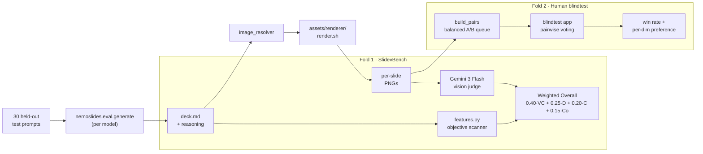

# 04 — Evaluation

*Two folds: **SlidevBench** (automated VLM judge + objective scanner) and a human blindtest. A Δ that appears in one fold without confirmation in the other is a red flag.*

## Protocol at a glance



Both folds consume the same rendered artifacts, same 30 prompts, same model set. The only variable between base and finetuned is the LoRA adapter.

## Test split and reference models

30 prompts from [`trillionlabs/slides-sft-v0`](https://huggingface.co/datasets/trillionlabs/slides-sft-v0), held out before training. Five reference points:

| Model | Role |
|---|---|
| `nemoslides-30b-a3b` (ours, SFT) | The Δ claim |
| `nvidia/nemotron-3-nano-30b-a3b` | SFT base — the "stock" number to beat |
| `nvidia/nemotron-3-super-120b-a12b` | Same family, 4× the active params. Clearing this proves real capability gain, not parameter-count-for-free. |
| `z-ai/glm-5.1` | Open-weight reasoning reference; ceiling for "can targeted SFT match a generalist". |
| `gpt-5.4` | Closed frontier reference; upper bound for context. |

A Δ that exists only relative to the stock nano but collapses vs. `nemotron-super` is a weaker claim than this 5-model baseline permits.

## SlidevBench rubric

Four dimensions, 1–5, weighted:

```
Overall = 0.40·VisCraft + 0.25·Design + 0.20·Content + 0.15·Coherence
```

**Subjective dims — Gemini 3 Flash judge.** `google/gemini-3-flash-preview`, vision-enabled via OpenRouter. The judge sees the user prompt + per-slide PNGs only (no markdown). Content = completeness relative to the prompt + factual sanity; Design = layout / typography / spacing / readability; Coherence = cross-slide narrative. The judge prompt ([`nemoslides.eval.rubric`](https://github.com/trillion-labs/nemoslides/blob/main/src/nemoslides/eval/rubric.py)) has explicit 5-point anchors, a generic-phrase blacklist that penalizes "the deck looks nice" rationales, an evidence-citation requirement tied to specific slide numbers, and forced JSON with retry. Gemini 3 Flash was chosen because it's vision-native, cheap enough (~$0.002/call) to iterate the rubric against the full 5×30 matrix, and not in the training-data path — Codex authored the corpus, Gemini scores it, no circular distillation.

**Objective dim — Visual Craft scanner.** [`nemoslides.eval.features`](https://github.com/trillion-labs/nemoslides/blob/main/src/nemoslides/eval/features.py) scans raw deck markdown for named layouts, shiki code blocks (with/without line-highlighting), Mermaid, KaTeX, `v-click`, presenter notes, transitions, and non-default theme. Counts map to a 1–5 score via fixed thresholds. **Un-gameable by judge model, judge prompt, or render pipeline** — it reads markdown directly and measures exactly what SFT targets. VisCraft carries the highest weight (0.40) because that's where the SFT delta lives; per-dim numbers are in [`comparison.json`](https://github.com/trillion-labs/nemoslides/blob/main/results/eval/comparison.json) for re-aggregation under any weighting.

Rubric derives from PPTEval ([PPTAgent, EMNLP 2025](https://arxiv.org/abs/2501.03936)) with two adaptations: `prompt_fidelity` folded into `content` (near-perfect correlation in practice); `visual_richness` replaced by the objective scanner above.

## Floor-scoring

Unrenderable decks score 1 across all dimensions — the published Overall. A model emitting invalid Slidev that fails to render is not producing a slide deck; the rubric doesn't reward it for failing quietly. The alternative — mean-over-renderable — is reported alongside for context.

## Human blindtest

**Status: 90 votes complete on the 4-model pre-SFT matrix.** Four annotators (`juyoung`, `wonsuk`, `wonsuk_homunculus`, `Hongjoon`), all 6 pairwise combinations × 15 pairs each. [`nemoslides.blindtest.build_pairs`](https://github.com/trillion-labs/nemoslides/blob/main/src/nemoslides/blindtest/build_pairs.py) builds a balanced queue; [`nemoslides.blindtest.app`](https://github.com/trillion-labs/nemoslides/blob/main/src/nemoslides/blindtest/app.py) is a Flask UI with model identity hidden until after the vote. Votes persist to `results/blindtest/votes.db`.

| Model | n | win rate |
|---|---|---|
| `gpt-5.4` | 45 | **60%** |
| `nemotron-super` | 45 | 53% |
| `glm-5.1` | 45 | 38% |
| `nemotron-nano` | 45 | 38% |

**VLM fold cross-check.** Humans and the Gemini judge agree at the extremes — `gpt-5.4` at the top, `nemotron-nano` at the bottom. They disagree in the middle: the VLM ranks `glm-5.1` > `nemotron-super`, humans reverse it. That's the kind of discrepancy the two-fold protocol exists to surface, and it shapes how much weight reviewers should give any single-fold claim.

Post-SFT pairs (`nemoslides-30b-a3b` vs. each rival, 60 pairs) are in the queue but not yet voted. Pairwise format was chosen over absolute scoring because an absolute fold would only replicate the VLM judge's signal; pairwise answers a different question and is less sensitive to anchor-calibration drift across raters.

## Render pipeline quirks

[`assets/renderer/render.sh`](https://github.com/trillion-labs/nemoslides/blob/main/assets/renderer/render.sh) resolves image queries and exports per-slide PNGs via Slidev + Playwright. Three concerns were fixed before the baseline froze:

| Concern | Mitigation |
|---|---|
| **Port race** — `slidev export` uses `getPort(12445)`; parallel invocations collide | `fcntl.flock`-serialized export |
| **Silent Vue errors** — `slidev export` exits 0 with garbled PNGs on compile failure | stdout scanner for `[vite] Internal server error`, `Element is missing end tag`, `YAMLParseError`, `ReferenceError: Unresolved alias` |
| **Fence-wrap single-slide renders** — weak models wrap whole deck in a ` ```markdown` fence | Min-slide guard (≥3 PNGs); `parse_deck` strips leading fences without touching code blocks in real decks |
