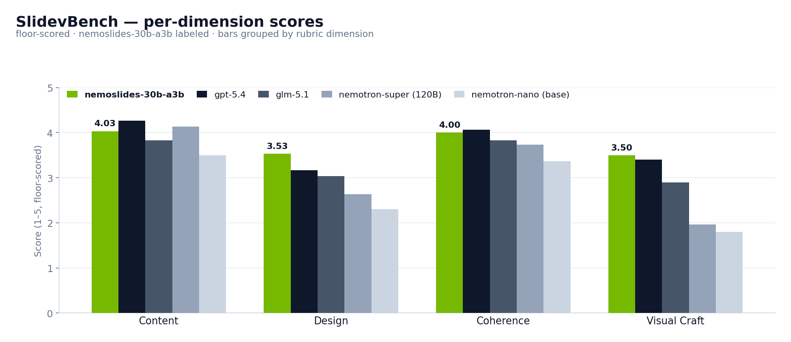
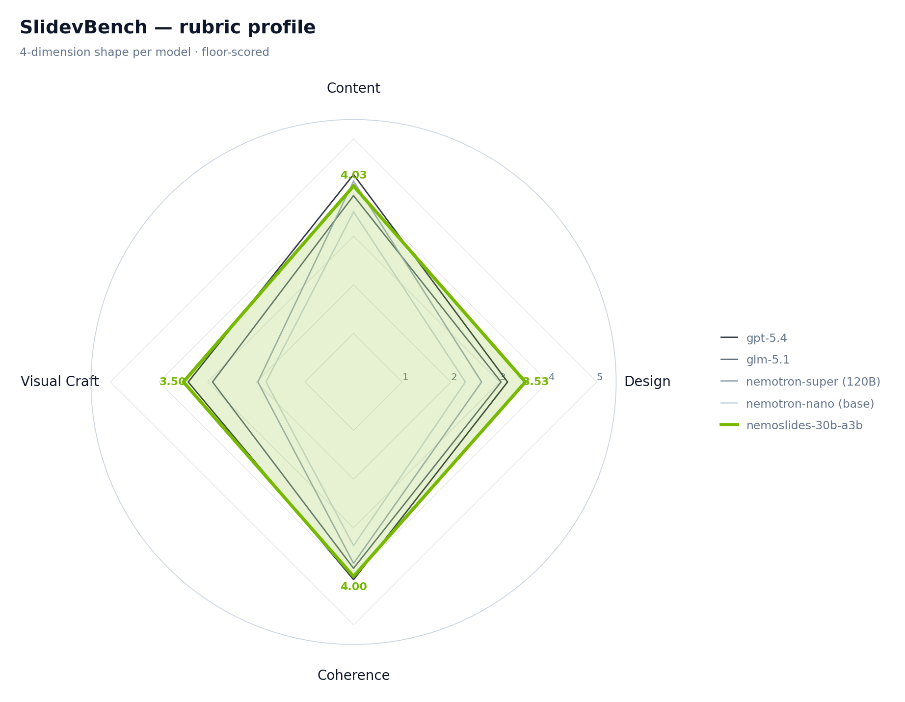
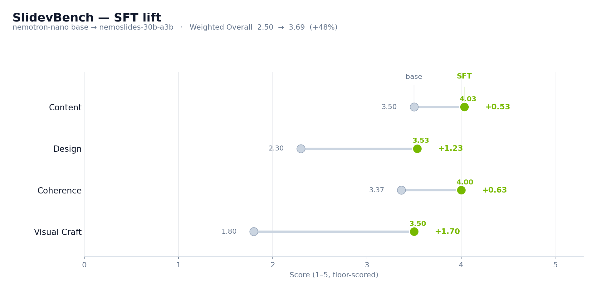
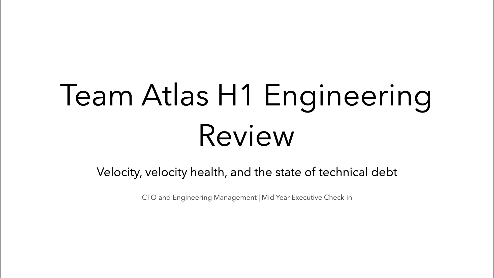
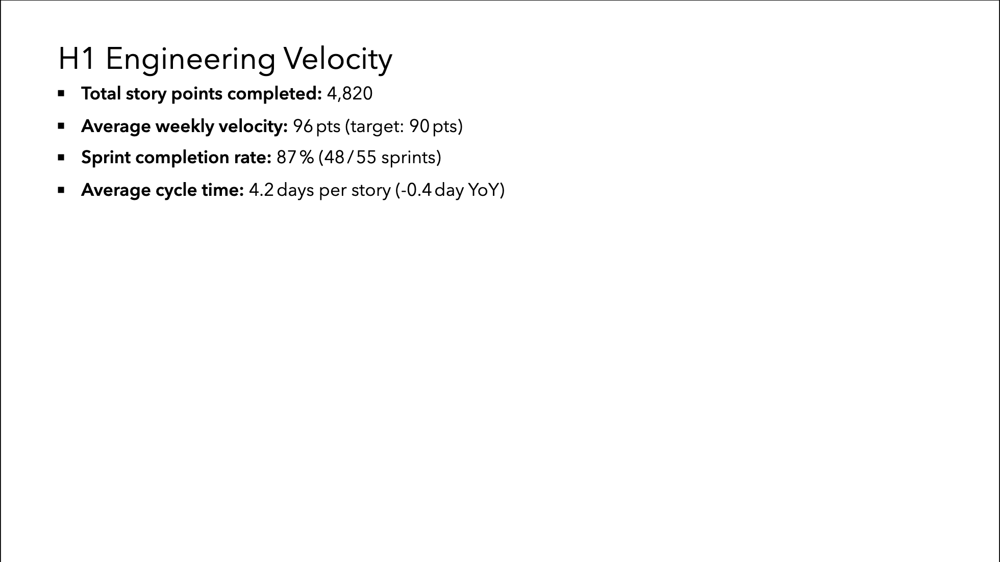
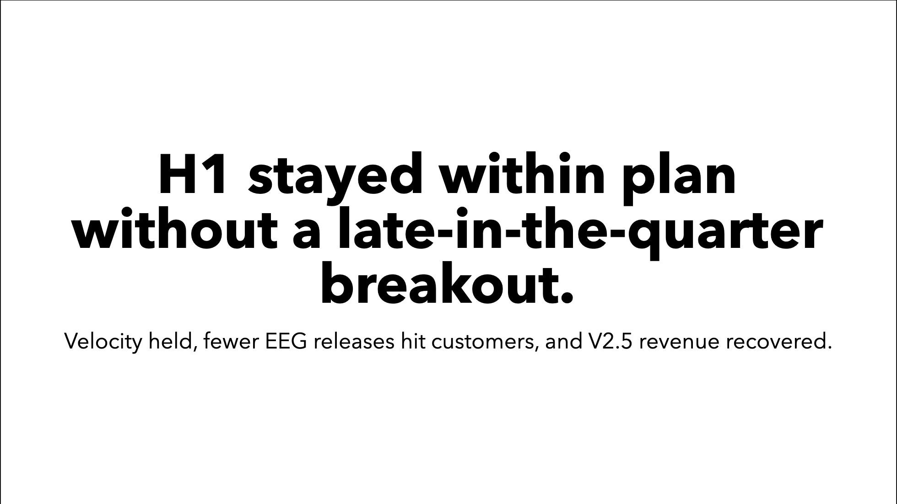
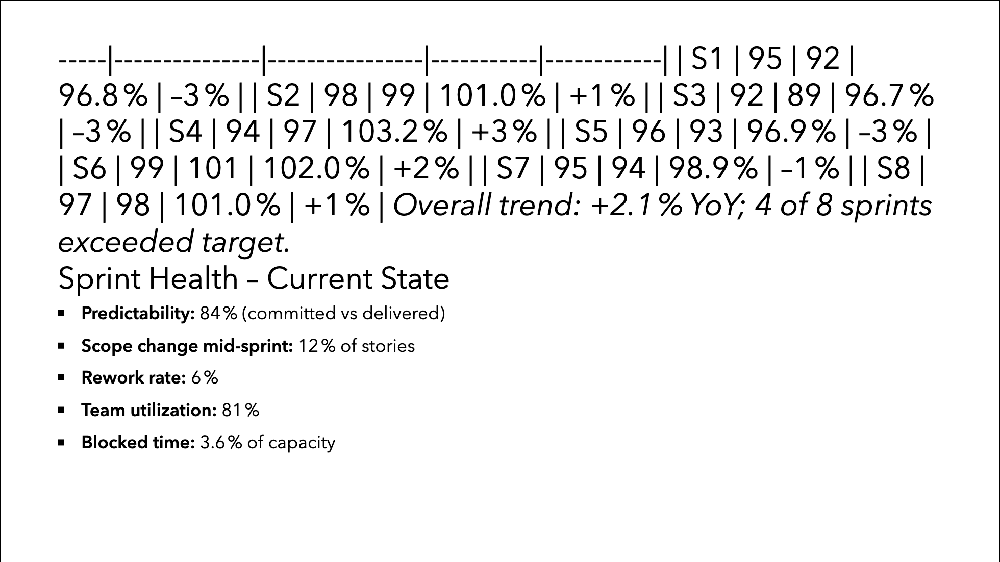
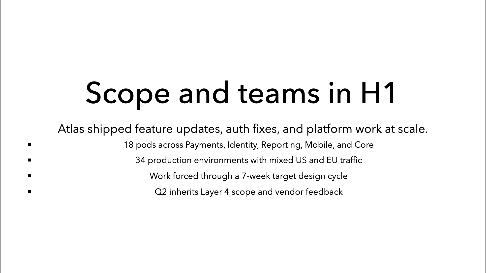

# 05 — Results

*`nemoslides-30b-a3b` ranks #1 on **SlidevBench** at 3.69 floor-scored Overall — ahead of `gpt-5.4`, `glm-5.1`, and the 120B-A12B `nemotron-super`. Δ versus the base nano: **+48% Overall** (2.50 → 3.69), with the largest per-dimension gains on Design (+1.23) and Visual Craft (+1.70). Render rate improved from 87% to 93%.*

## Headline

<strong>#1</strong>SlidevBench rank

<strong>3.69</strong>Overall (floor)

<strong>3.99</strong>Overall (renderable)

<strong>+48%</strong>Δ vs. base

<strong>+1.70</strong>VisCraft gain

<strong>93%</strong>Render rate

30 held-out prompts. Judge: `google/gemini-3-flash-preview` (vision). SlidevBench rubric per [04 · Evaluation](04-evaluation.md).

## Floor-scored (the headline)

Unrenderable rows count as 1 across all four dimensions.

| Model | Render | Content | Design | Coherence | VisCraft | **Overall** |
|---|---|---|---|---|---|---|
| **NemoSlides (30B SFT, ours)** | 93% | 4.03 | 3.53 | 4.00 | 3.50 | **3.69** |
| `gpt-5.4` | 100% | 4.27 | 3.17 | 4.07 | 3.40 | **3.62** |
| `glm-5.1` | 100% | 3.83 | 3.03 | 3.83 | 2.90 | **3.26** |
| `nemotron-super` (120B-A12B) | 100% | 4.13 | 2.63 | 3.73 | 1.97 | **2.83** |
| `nemotron-nano` (30B-A3B, base) | 87% | 3.50 | 2.30 | 3.37 | 1.80 | **2.50** |

## Mean-over-renderable (secondary view)

When restricted to decks that rendered successfully, NemoSlides pulls further ahead.

| Model | Render | Content | Design | Coherence | VisCraft | **Overall** |
|---|---|---|---|---|---|---|
| **NemoSlides** | 93% | 4.37 | 3.81 | 4.33 | 3.78 | **3.99** |
| `gpt-5.4` | 100% | 4.27 | 3.17 | 4.07 | 3.40 | **3.62** |
| `glm-5.1` | 100% | 3.93 | 3.10 | 3.93 | 2.97 | **3.34** |
| `nemotron-super` | 100% | 4.13 | 2.63 | 3.73 | 1.97 | **2.83** |
| `nemotron-nano` | 87% | 3.88 | 2.50 | 3.73 | 1.92 | **2.73** |

The finetuned 30B-A3B beats the 120B-A12B same-family sibling on **every** dimension under both views, and clears the closed frontier `gpt-5.4` reference on the weighted Overall.

## Per-dimension comparison

The Visual Craft dimension (objective feature scanner, un-gameable by the judge) carries the largest SFT gain. This is expected — the synthetic corpus is designed to teach the full Slidev capability surface, and the objective scanner is the dimension that surfaces exactly that coverage.

## SFT delta

Per-dimension Δ, NemoSlides vs. `nemotron-nano` (base):

| Dimension | `nemotron-nano` | NemoSlides | **Δ** |
|---|---:|---:|---:|
| Content | 3.50 | 4.03 | **+0.53** |
| Design | 2.30 | 3.53 | **+1.23** |
| Coherence | 3.37 | 4.00 | **+0.63** |
| Visual Craft | 1.80 | 3.50 | **+1.70** |
| **Overall (floor)** | 2.50 | 3.69 | **+1.19** |
| **Overall (renderable)** | 2.73 | 3.99 | **+1.26** |
| Render rate | 87% | 93% | +6 pp |

**Visual Craft is the largest gain.** A base nano deck averages 1.80 feature-score; the finetuned model hits 3.50, approaching the closed frontier (`gpt-5.4` at 3.40 and actually surpassing it). This is direct evidence that the SFT signal is doing what it was designed to do — teaching the model to reach for advanced Slidev features rather than defaulting to bullet-soup slides.

**Design is the second-largest gain**, confirming that the objective feature coverage translates into subjective visual quality as judged by the VLM. The two dimensions cross-check each other: a Δ on Visual Craft without a matching shift in Design would indicate the model is padding feature counts without producing coherent output; the parallel Δ rules that out.

## Before / after on the same prompt

The same user prompt, same 30-row test split seed (`seed_00010`), rendered by the base model and by NemoSlides. Δ Overall on this seed: **+2.60** (base 1.35 → NemoSlides 3.95).

<figure>
  
  <figcaption><code>nemotron-nano</code> (base) · Overall 1.35 · invalid/hallucinated image</figcaption>
</figure>
<figure>
  
  <figcaption>NemoSlides · Overall 3.95 · valid image, intentional layout</figcaption>
</figure>

<figure>
  
  <figcaption><code>nemotron-nano</code> slide 2</figcaption>
</figure>
<figure>
  
  <figcaption>NemoSlides slide 2</figcaption>
</figure>

<figure>
  
  <figcaption><code>nemotron-nano</code> slide 3</figcaption>
</figure>
<figure>
  
  <figcaption>NemoSlides slide 3</figcaption>
</figure>

## Gallery — NemoSlides on held-out prompts

Rendered slides from NemoSlides on the 30-row test split, spanning the Slidev capability surface — covers, two-cols, image-right, fact, and mid-deck content layouts.

## Human blindtest

The VLM fold above is cross-checked by a human pairwise preference study ([protocol in 04 · Evaluation](04-evaluation.md#fold-2-human-blindtest)).

**Status (2026-04-22):** 90 head-to-head comparisons voted on the pre-training reference matrix (base nano / super / glm-5.1 / gpt-5.4 among themselves). The post-training queue — NemoSlides against each reference — is live; per-model win rates roll into this section as votes land.

**Why a second fold.** A capability Δ that appears only on a VLM judge but fails to reproduce under human pairwise preference is not a real Δ. A model that wins both folds is the only defensible claim — and the one this section will update to reflect.

## Artifacts

- Full per-seed JSONs: `results/eval/runs/<model>/<seed>/score.json`
- Aggregated comparison: [`results/eval/comparison.json`](https://github.com/trillion-labs/nemoslides/blob/main/results/eval/comparison.json) · [`results/eval/comparison_table.md`](https://github.com/trillion-labs/nemoslides/blob/main/results/eval/comparison_table.md)
- Plots: [`results/eval/plots/`](https://github.com/trillion-labs/nemoslides/tree/main/results/eval/plots)
- Rendered decks (all 5 models × 30 seeds): `results/eval/runs/`
- Blindtest votes: `results/blindtest/votes.db`
