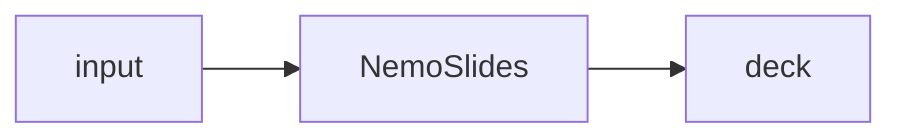

# Diagrams

Two paths for diagrams in this site.

## Mermaid (handDrawn) — inline in markdown

All diagram blocks in `docs/**` authored as Mermaid render with Excalidraw-style
hand-drawn aesthetic via `docs/assets/javascripts/mermaid-init.js` (Mermaid 11+
`look: handDrawn`). No build steps; lives alongside the prose.

Example:

````markdown

````

## Excalidraw — hero illustrations only

For high-polish hero illustrations (`docs/index.md` architecture frontispiece,
`docs/04-evaluation.md` rubric explainer), export from [excalidraw.com](https://excalidraw.com):

1. Draw in Excalidraw.
2. **Export → SVG** with "Embed scene" enabled — the resulting SVG is
   re-editable on reopen.
3. Save both files to this directory:
   - `architecture.svg` (or equivalent name)
   - `architecture.excalidraw` (source for future edits)
4. In the markdown, replace the placeholder Mermaid block with:
   ```markdown
   <figure class="ns-figure">
     
     <figcaption>End-to-end architecture.</figcaption>
   </figure>
   ```

Keep SVG dimensions under ~1600px wide for acceptable load on the Pages site.
