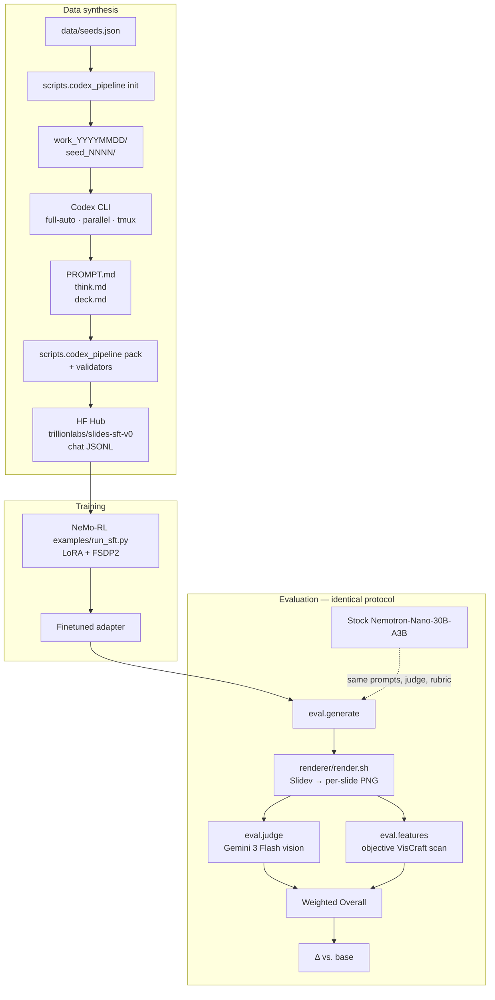

# slides-sft — technical docs

A reviewer-facing writeup of what we built, how, and why it works.

## TL;DR

Slide generation is a hard, high-impact problem with no good open-weight answer. Closed-source incumbents (Gamma, Beautiful.ai, Canva Magic Design) dominate; the open side has small templated tools and research prototypes. People complain about this gap publicly and often.

In 48 hours, solo, we fine-tuned `Nemotron-3-Nano-30B-A3B` — a 30B-parameter MoE with 3B active — on a Codex-authored synthetic Slidev corpus, using **only the NVIDIA training stack** (NeMo-RL + LoRA + FSDP2 + the published 2n8g recipe). Every number the project claims derives from a single locked protocol: same prompts, same judge, same rubric, base-vs-finetuned. No cherry-picking.

Two claims this doc set defends:

1. **The Δ is real.** Rubric locked before training. Baseline numbers locked before training. Floor-scoring penalizes invalid Slidev so a model that emits garbage cannot hide behind unrenderable rows. The PPTEval-derived judge is cross-checked by an objective feature scanner that counts Slidev primitives directly.
2. **The training methodology is NVIDIA-stack-native.** Post-trained Nemotron with its own `<think>` reasoning format. NeMo-RL's `run_sft.py` against its own LoRA+FSDP2 recipe. No alternative trainers. The hackathon eligibility requirement is met by the same code path that does the actual work.

## Headline numbers

30 held-out prompts, floor-scored, rubric v5. Judge: `google/gemini-3-flash-preview` (vision). Weighted Overall = `0.40·VisCraft + 0.25·Design + 0.20·Content + 0.15·Coherence`.

| Model | Render | Content | Design | Coherence | VisCraft | **Overall** |
|---|---|---|---|---|---|---|
| `gpt-5.4` (frontier reference) | 100% | 4.27 | 3.17 | 4.07 | 3.40 | **3.62** |
| `glm-5.1` (open-weight reference) | 100% | 3.83 | 3.03 | 3.83 | 2.90 | **3.26** |
| `nemotron-super` (120B-A12B, larger sibling) | 100% | 4.13 | 2.63 | 3.73 | 1.97 | **2.83** |
| **`nemotron-nano` (30B-A3B, SFT target)** | 87% | 3.50 | 2.30 | 3.37 | 1.80 | **2.50** |
| **Finetuned (ours)** | — | — | — | — | — | **—** |
| **Δ vs. base** | — | — | — | — | — | **—** |

Base-model anchor is `nemotron-nano` at 2.50 floor-scored Overall. SFT must-have: clear the larger `nemotron-super` sibling (2.83) despite being 4× smaller in active params. Stretch: close the gap to `glm-5.1` (3.26).

## Pipeline at a glance

## Reading order

1. [**01-problem.md**](01-problem.md) — why slide generation is hard, why open-weight matters, the thesis.
2. [**02-data-pipeline.md**](02-data-pipeline.md) — Codex-authored corpus, per-seed validators, Slidev feature coverage, the image-query placeholder trick. Decisions inline.
3. [**03-training.md**](03-training.md) — post-trained Nemotron, native `<think>` format, NeMo-RL SFT with LoRA+FSDP2, chat-JSONL training format. Decisions inline.
4. [**04-evaluation.md**](04-evaluation.md) — what PPTEval is, what we changed (rubric v5), why the changes hold up, the four-model baseline, the render-bug scars. Longest doc. Decisions inline.
5. [**qualitative evidence**](qualitative/notes.md) — side-by-side base-vs-teacher renders from the hour-1 competence check. Visual evidence of the gap we're closing.

## Non-doc references

- [Install + reproduce commands (repo README)](https://github.com/trillion-labs/slides-sft#readme)
- [Hour-by-hour execution plan (`PLAN.md`)](https://github.com/trillion-labs/slides-sft/blob/main/PLAN.md)
- [Live execution log (`PROGRESS.md`)](https://github.com/trillion-labs/slides-sft/blob/main/PROGRESS.md)
- [Full 4-model eval table (`eval/comparison_table.md`)](https://github.com/trillion-labs/slides-sft/blob/main/eval/comparison_table.md)
- [Dataset on HF Hub (private)](https://huggingface.co/datasets/trillionlabs/slides-sft-v0) — 705 train / 30 test chat-JSONL.
