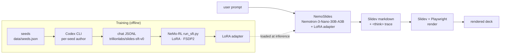
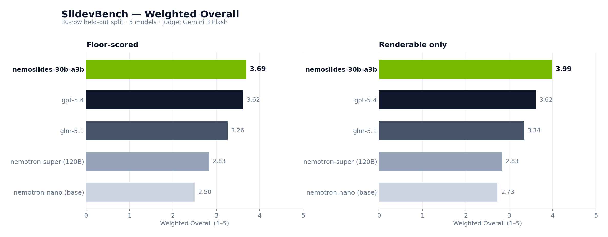
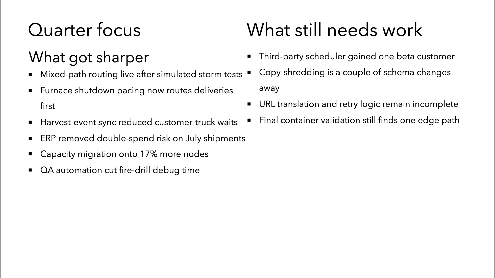
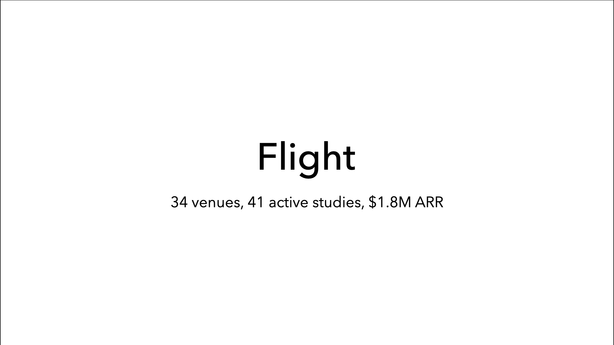
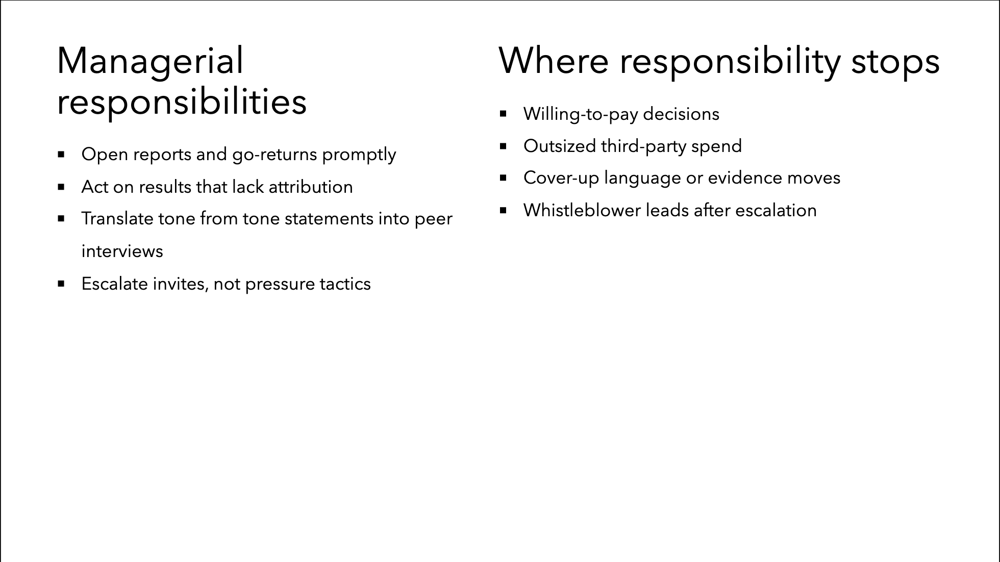
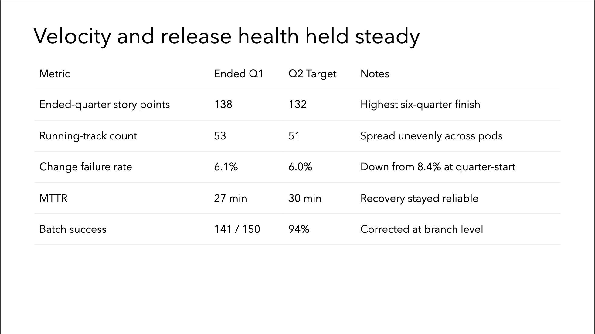

# NemoSlides

**Open-weight slide generation, fine-tuned on Nemotron.**

NemoSlides fine-tunes `NVIDIA-Nemotron-3-Nano-30B-A3B` on a 705-sample synthetic corpus of Slidev decks. The resulting 30B-parameter MoE (3B active) generates presentation-grade decks from a single prompt and ranks **#1** on the 30-row **SlidevBench** test split — ahead of `gpt-5.4`, `glm-5.1`, and the 120B-A12B `nemotron-super`.

<strong>#1</strong>SlidevBench rank

<strong>3.69</strong>Overall (floor)

<strong>3.99</strong>Overall (renderable)

<strong>+48%</strong>Δ vs. base nano

<strong>93%</strong>Render rate

<strong>30B / 3B</strong>Total / active

## Architecture

NemoSlides is a supervised fine-tune on top of NVIDIA's post-trained Nemotron-3-Nano-30B-A3B. Training runs through NeMo-RL's `run_sft.py` with LoRA + FSDP2 on a published 2n8g recipe. Evaluation reuses the same vLLM inference path as the base model, isolating the adapter as the only variable.

*A hand-drawn Excalidraw replacement for this diagram lives at `docs/assets/diagrams/architecture.svg` once rendered; see [`docs/assets/diagrams/README.md`](https://github.com/trillion-labs/nemoslides/blob/main/docs/assets/diagrams) for the export workflow.*

## Headline results

**SlidevBench** — 30 held-out prompts. Judge: `google/gemini-3-flash-preview` (vision). Rubric: Content / Design / Coherence (judge) + Visual Craft (objective Slidev-feature scan). Weighted Overall = `0.40·VisCraft + 0.25·Design + 0.20·Content + 0.15·Coherence`.

| Model | Render | Content | Design | Coherence | VisCraft | **Overall** |
|---|---|---|---|---|---|---|
| **`nemoslides-30b-a3b`** (ours) | 93% | 4.03 | 3.53 | 4.00 | 3.50 | **3.69** |
| `gpt-5.4` | 100% | 4.27 | 3.17 | 4.07 | 3.40 | **3.62** |
| `glm-5.1` | 100% | 3.83 | 3.03 | 3.83 | 2.90 | **3.26** |
| `nemotron-super` (120B-A12B) | 100% | 4.13 | 2.63 | 3.73 | 1.97 | **2.83** |
| `nemotron-nano` (30B-A3B, base) | 87% | 3.50 | 2.30 | 3.37 | 1.80 | **2.50** |

Full results, per-dimension tables, and Δ analysis live in [05 · Results](05-results.md).

## What NemoSlides generates

Rendered slides from the finetuned model on held-out test prompts — layouts span `cover`, `two-cols`, `image-right`, `fact`, `center`, `end`, shiki code blocks, Mermaid diagrams, and `v-click` progressive reveals.

See the full side-by-side comparison of all 5 models on all 30 SlidevBench prompts in the [**SlidevBench gallery →**](../gallery/){ target=_blank }

## Documentation

This site covers the technical implementation in five parts.

| Section | Contents |
|---|---|
| [01 · Architecture](01-overview.md) | System components, module layout, inference + training stacks, request/response flow |
| [02 · Data](02-data.md) | Synthesis pipeline (Data Designer + Codex), dataset schema, validators, feature coverage |
| [03 · Training](03-training.md) | Base model, NeMo-RL SFT recipe, LoRA + FSDP2 config, chat-JSONL format, inference-time setup |
| [04 · Evaluation](04-evaluation.md) | SlidevBench definition, two-fold protocol (VLM judge + human blindtest), rubric anchors, feature scanner |
| [05 · Results](05-results.md) | Headline numbers, per-dimension breakdown, SFT Δ, before/after, blindtest status |
| [Reproduce](reproduce.md) | Full repro playbook — baseline eval, synthesis, training, finetuned eval |

## References

- **Base model:** [`nvidia/NVIDIA-Nemotron-3-Nano-30B-A3B-BF16`](https://huggingface.co/nvidia/NVIDIA-Nemotron-3-Nano-30B-A3B-BF16)
- **Training framework:** [NVIDIA-NeMo/RL](https://github.com/NVIDIA-NeMo/RL) · recipe [`sft-nanov3-30BA3B-2n8g-fsdp2-lora.yaml`](https://github.com/NVIDIA-NeMo/RL/tree/main/examples/configs/recipes/llm)
- **Data synthesis:** [NVIDIA-NeMo/DataDesigner](https://github.com/NVIDIA-NeMo/DataDesigner)
- **Rubric:** [PPTAgent, EMNLP 2025](https://arxiv.org/abs/2501.03936) · [AutoPresent, CVPR 2025](https://arxiv.org/abs/2501.00912)
- **Slide format:** [Slidev](https://sli.dev)
- **Dataset:** [`trillionlabs/slides-sft-v0`](https://huggingface.co/datasets/trillionlabs/slides-sft-v0)
- **Source:** [`trillion-labs/nemoslides`](https://github.com/trillion-labs/nemoslides)
