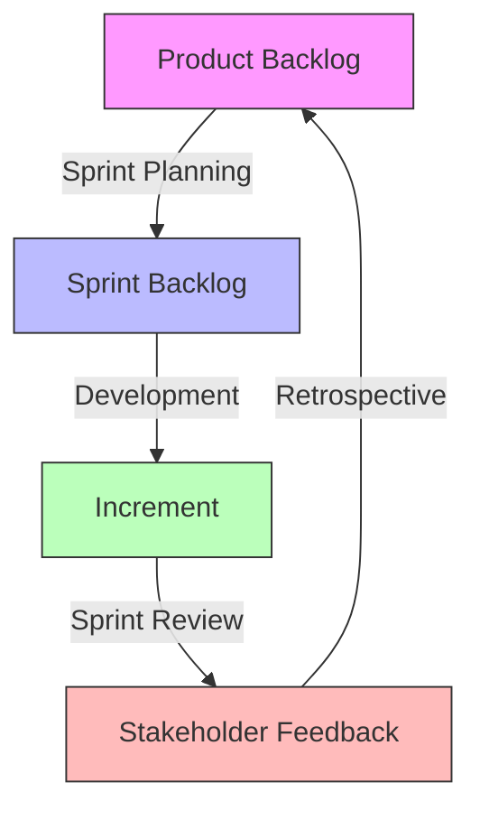
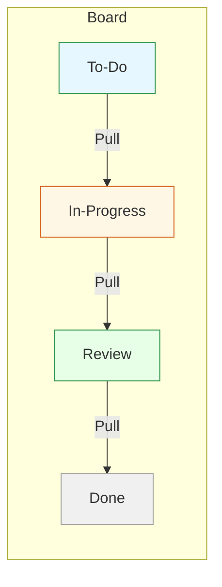

<!-- Slide 1 -->
# Agile Foundations for New Associates  

## Internal Training Workshop  
*Designed for freshly‑onboarded team members*  

---  

<!-- Slide 2 -->
# What We’ll Cover  

- Core ideas of **Scrum**, **Kanban**, and **Lean**  
- When each framework shines  
- Your role in the key agile ceremonies  
- Practical **30‑day action plan** you can start today  

---  

<!-- Slide 3 -->
# Agile in a Nutshell  

- **Iterative delivery** – ship small, learn fast  
- **Customer focus** – continuously deliver value  
- **Collaboration** – cross‑functional, self‑organising teams  
- **Transparency** – work is visible to everyone  

> *Why it matters:*  
> • Faster feedback → quicker course‑correction  
> • Clear visibility → fewer bottlenecks  
> • Empowered teams → higher ownership  

---

---  

<!-- Slide 4 -->
# Scrum – The “Framework”  

- Time‑boxed **Sprints** (usually 2‑4 weeks)  
- Defined **Roles**: Product Owner, Scrum Master, Development Team  
- Core **Artefacts**: Product Backlog, Sprint Backlog, Increment  
- Events: **Sprint Planning**, **Daily Stand‑up**, **Sprint Review**, **Sprint Retrospective**  

*Visual:* simple flow diagram (Mermaid)  



---  

<!-- Slide 5 -->
# Scrum in Practice  

| Ceremony | What Happens | What You Do |
|----------|--------------|-------------|
| **Sprint Planning** | Team selects work for the sprint, estimates effort | Understand the selected items, ask clarifying questions |
| **Daily Stand‑up** | 15‑min sync on what you did, plan, blockers | Share a brief status, raise impediments early |
| **Sprint Review** | Demo of completed work to stakeholders | Show your piece, gather feedback |
| **Sprint Retrospective** | Process improvement discussion | Suggest one improvement, take note of action items |

---  

<!-- Slide 6 -->
# When Scrum Fits  

- Work is **predictable in cadence** but **uncertain in detail**  
- Product Owner can clearly prioritise backlog items  
- Team size ~5‑9 developers (or equivalents)  
- Frequent stakeholder feedback is needed  

*The typical new‑hire scenario:* you’ll join a sprint team, learn the backlog grooming process, and start contributing user stories or tasks.  

---  

<!-- Slide 7 -->
# Kanban – Flow‑Focused  

- Visual board with **Columns** (e.g., To‑Do → In‑Progress → Review → Done)  
- No fixed iterations; work is pulled continuously  
- Limits **Work‑In‑Progress (WIP)** to improve flow  
- Emphasises **Cumulative Flow Diagrams** for metrics  

*Visual:* minimal Kanban board mock‑up  



---  

<!-- Slide 8 -->
# When Kanban Shines  

- **Steady stream** of work with frequent interruptions  
- Need **continuous delivery** (e.g., support, maintenance)  
- Team size may fluctuate or be small  
- Emphasis on **visualising bottlenecks** and limiting WIP  

*New‑hire tip:* you’ll pull the next highest‑priority item, keep the board updated, and signal when you’re blocked.  

---  

<!-- Slide 9 -->
# Lean – Eliminate Waste  

- Focus on **value** for the customer  
- Identify and remove the **8 wastes** (over‑production, waiting, transport, etc.)  
- **Principles**:  
  1. **Eliminate waste**  
  2. **Build quality in**  
  3. **Create knowledge**  
  4. **Defer commitment**  
  5. **Respect people**  
  6. **Optimize the whole**  

*Visual:* simple “Lean Loop” diagram  


---  

<!-- Slide 9b -->
# Lean in Your Daily Work  

- **Ask:** “Is this activity adding value for the customer?”  
- **Stop** unnecessary hand‑offs or re‑work  
- **Continuously improve** your process (even small tweaks)  

*Example:* Eliminate double‑checking a spec that’s already been agreed upon.  

---  

<!-- Slide 10 -->
# Choosing the Right Framework  

| Situation | Recommended Framework |
|-----------|------------------------|
| Regular sprint cadence, clear product backlog | **Scrum** |
| High variability, many urgent tickets | **Kanban** |
| Want to improve culture / process efficiency | **Lean** (or lean‑Scrum hybrid) |

*Key insight:* Many teams blend them – e.g., Scrum with Kanban board, or “Scrumban”.  

---  

<!-- Slide 11 -->
# How to Participate in Planning  

1. **Read the backlog items** you’re assigned – know the goal.  
2. **Ask**:  
   - What is the acceptance criteria?  
   - Do I have everything I need (designs, docs, access)?  
3. **Estimate** (if using story points) using Planning Poker.  
4. **Commit** to a realistic slice of work for the sprint.  

*Practical tip:* Bring a **“Definition of Done”** checklist to every planning meeting.  

---  

<!-- Slide 12 -->
# Daily Stand‑up & Review/Retro  

**Stand‑up (15 min)**  
- Format: *What I did yesterday → What I’ll do today → Blockers*  
- Keep it concise – use a timer if needed.  

**Sprint Review (1‑hour)**  
- Show the increment to stakeholders.  
- Gather feedback, note any new backlog items.  

**Retrospective (45 min)**  
- **Start / Stop / Continue** format is common.  
- Propose ONE concrete improvement and own it.  

---  

<!-- Slide 13 -->
# Your 30‑Day Action Plan  

| Day | Action | Expected Outcome |
|-----|--------|------------------|
| 1‑3 | Attend a **Sprint Planning** as an observer | Understand backlog grooming & estimation |
| 4‑7 | Pair with a teammate to complete a **user story** | See how work moves from backlog to Done |
| 8‑14 | Lead a **daily stand‑up** (or at least share a status) | Build confidence in communication |
| 15‑21 | Participate in a **Sprint Review** & take notes on feedback | Learn stakeholder expectations |
| 22‑30 | Draft a **process improvement** and propose it in a retro | Demonstrate Lean thinking |
| Ongoing | Update your personal **Kanban board** daily | Keep work visible, spot blockers early |

> **Your first ticket:** Pick a small, well‑scoped item, move it across the board, and close it before the sprint ends. Celebrate the win and note what helped you succeed.  

---  

<!-- Slide 14 -->
# Q&A  

*Any questions about applying Scrum, Kanban, or Lean in your first weeks?*  

---  

<!-- Slide 15 (optional) -->
# Thank You!  

- Keep this slide deck handy (markdown file).  
- Refer to the **“30‑Day Action Plan”** whenever you’re unsure where to start.  

```  

*End of Presentation*