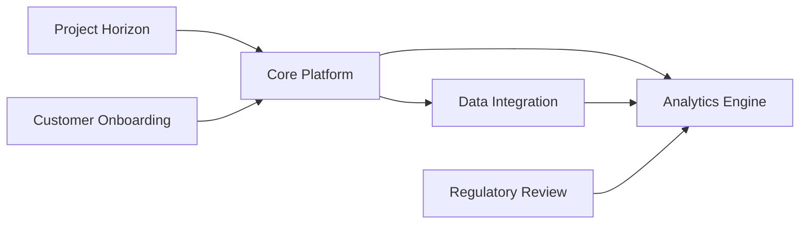

Here is a complete, render‑ready Slidev markdown file for an 8‑slide executive quarterly update on **Project Horizon**.  
Save the content as `project-horizon-quarterly.md` and open it with Slidev (or any Slidev‑compatible viewer).

```markdown
---
marp: true
theme: default
paginate: true
---

# Project Horizon – Quarterly Executive Update  
*Senior Leadership Quarterly Review – Q2 2025*  

---  

## 1. Agenda
- Cross‑functional status check  
- What changed this quarter  
- Q3 pilot outlook  
- Top risks & mitigation  
- Leadership decisions needed  

---  

## 2. What Changed This Quarter?
- **Scope refinement** – adjusted deliverable dates based on stakeholder feedback.  
- **Budget re‑allocation** – 5 % shift from Phase 2 to Phase 3 to accelerate pilot readiness.  
- **Team composition** – added two data‑engineers; formed a dedicated change‑management workstream.  
- **Key milestones met** – 87 % of Phase 1 requirements completed, QA sign‑off on core architecture.  

---  

## 3. Cross‑Functional Status Overview
| Function | Status | Key Metric (Q2 2025) |
|----------|--------|----------------------|
| **Engineering** | On track | 92 % of core APIs released |
| **Product** | On track | Acceptance criteria 88 % satisfied |
| **Data Analytics** | Slight lag* | Data pipeline completeness 78 % |
| **Operations** | On track | Production environment 100 % provisioned |
| **Compliance** | On track | All regulatory milestones met |

> \*Mitigation plan activated – additional resources allocated next week.  

---  

## 4. Q3 Pilot – Target Milestones
| Milestone | Target Date | Owner |
|-----------|-------------|-------|
| Pilot environment go‑live | 15 Oct 2025 | Engineering |
| End‑to‑end test suite execution | 30 Oct 2025 | QA |
| Pilot performance monitoring | 15 Nov 2025 | Analytics |
| Pilot executive review | 30 Nov 2025 | Product |

- **Goal:** Validate end‑to‑end workflow with 3 pilot customers.  
- **Success criteria:** ≥ 80 % system uptime, ≤ 5 % error rate, positive user NPS ≥ 30.  

---  

## 5. Biggest Risks & Early Mitigations
- **Data pipeline latency** – proceeding with buffer capacity increase; back‑up manually‑curated datasets.  
- **Customer acceptance** – early workshops scheduled; continuous feedback loop instituted.  
- **Resource bandwidth** – cross‑trained team members; contingency staffing identified.  

---  

## 6. Decision Points for Leadership
1. **Approve additional budget shift** (5 % of Q3 funds) to fast‑track analytics integration.  
2. **Select pilot customer cohort** (finalize list of 3 partners).  
3. **Confirm go‑live date** for the pilot environment (flexibility within ±2 weeks).  
4. **Endorse risk‑mitigation plan** for data latency (including extra cloud capacity).  

---  

## 7. Dependencies (Mermaid Diagram)



- Clear visual of core inter‑dependencies; highlights where bottlenecks may affect downstream activities.  

---  

## 8. Next Steps & Call to Action
- **Immediate (next 2 weeks):**  
  - Complete resource allocation for pilot environment.  
  - Confirm pilot customer list.  
- **Next month:**  
  - Execute integration testing; iterate on feedback.  
  - Prepare executive‑ready pilot results deck.  
- **Leadership actions:** Provide the four decisions listed above by **15 Oct** to keep the Q3 timeline on track.  

---  

*Prepared by: Project Horizon Leadership Team*  
*Date: 2 Nov 2025*  
---