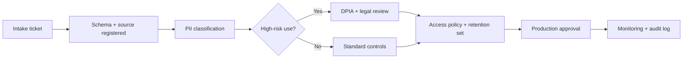

# New GDPR Compliance Workflow

### How data engineering and compliance now ship together

  Internal rollout briefing · 10 slides

---
layout: statement
---

# GDPR is now a release gate, not a quarterly audit.

### The workflow starts when data is proposed, not after it ships.

---
layout: two-cols
---

# What changed

- New datasets need intake before ingestion
- PII tags travel with schemas and lineage
- DPIA review happens before production access
- DSAR readiness is checked before launch
- Exceptions need an owner and expiry

::right::

# Why both teams care

- Engineers avoid late rework and blocked deploys
- Compliance sees controls inside real pipelines
- Incident response uses the same lineage graph
- Audit evidence comes from system records
- Fewer spreadsheet handoffs, fewer blind spots

---
layout: section
---

# From Intake To Production

### The workflow becomes part of the platform path.

---
layout: default
---

# The new workflow

<!-- Escalate to DPIA when sensitive data, profiling, or new transfers appear. -->

---
layout: image-right
image: https://images.pexels.com/photos/7947753/pexels-photo-7947753.jpeg?auto=compress&cs=tinysrgb&dpr=2&h=650&w=940
---

# Four engineering checkpoints

- Register source system and data owner
- Tag direct and inferred identifiers
- Set retention and deletion policy
- Bind access to approved purpose

If one checkpoint is missing, the dataset does not promote.

---
layout: two-cols
---

# Engineering owns

- Schema changes in Git and CI
- PII tags in dbt metadata
- Retention jobs in orchestration
- Access reviews every 90 days
- Breach signals into incident tooling

::right::

# Compliance owns

- Lawful basis and RoPA entry
- DPIA decision within 5 business days
- SCC review for new processors
- DSAR playbook and evidence standard
- Exception approval with expiry date

---
layout: fact
---

# 30 days

### Maximum time to answer a GDPR data subject request

---
layout: default
---

# First 30-day rollout plan

- Week 1: add intake template to Jira
- Week 2: require tags in dbt CI
- Week 3: automate RoPA evidence export
- Week 4: drill one DSAR end-to-end
- Track blocked releases, review time, exceptions

---
layout: end
---

# Treat privacy metadata like production metadata.

### Start with intake, enforce tags in CI, and review the first live dataset this month.
